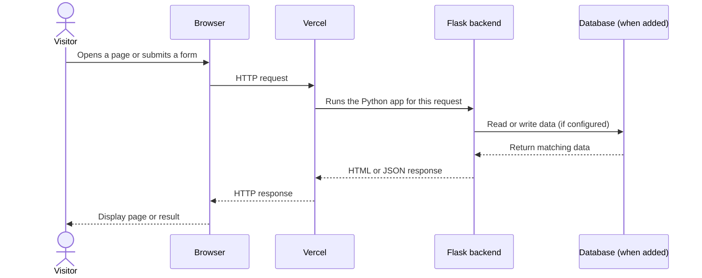

# Build a Simple Website with Flask and Vercel

This repository is a small teaching example for explaining how a website is put together and how its parts communicate. It uses **Flask** for the Python backend and **Vercel** to host the app. The project is a starting point: it does not include a database yet, so the database section below shows where one fits and what to add.

## The three parts of a website

Think of a website as three cooperating parts:

| Part | What it does | In this example |
| --- | --- | --- |
| Frontend | Shows pages, forms, buttons, and results to the visitor. | HTML and CSS files served by the Flask app. A browser runs the frontend. |
| Backend | Receives requests, applies rules, and returns a page or data. | Python routes in the Flask application. |
| Database | Keeps information so it is still available after a request ends. | Not included yet. Add a hosted database when the site needs persistent data. |

The browser and server communicate with HTTP. A **request** goes from the browser to a URL on the server; the server sends back a **response**, often HTML or JSON.

## What happens when someone visits the site?



For a simple page, the database steps are skipped. For example, a Flask route can return a welcome page directly. For a form that saves feedback, Flask validates the submitted fields and writes them to the database; a later request can read them back.

## How this repository is organized

- `api/` contains the Python entry point used by Vercel's serverless Python runtime.
- `vercel.json` tells Vercel how to route incoming requests to the Flask app.
- `requirements.txt` lists Python packages that Vercel needs to install, including Flask.

In this setup Vercel invokes the Flask application through its Python runtime when a request arrives. You do not keep a traditional Flask server process running on Vercel. Vercel handles the hosting and request routing; Flask still defines the site's routes and behavior.

## Run the example locally

You need Python and Node.js/npm installed. From the repository root:

```bash
python -m venv .venv
source .venv/bin/activate       # Windows PowerShell: .venv\Scripts\Activate.ps1
pip install -r requirements.txt
npm install --global vercel
vercel dev
```

Open the local URL printed by Vercel (typically `http://localhost:3000`). `vercel dev` runs a local development environment that follows the Vercel project configuration.

## Deploy on Vercel

1. Fork or clone this repository and push it to your Git provider.
2. Sign in to Vercel and import the repository as a new project.
3. Confirm the project settings and deploy. Vercel detects the Python app using the repository configuration.
4. Open the deployment URL and try the routes in a browser.

When you push later changes to the connected repository, Vercel can build and deploy an updated version. For a live project, configure any required environment variables in the Vercel project settings; do not commit secrets to Git.

## Add a database

The current starter has no database dependency or persistence layer. To make a site that stores user-created information:

1. Choose a database that can be reached from Vercel (for example, a hosted PostgreSQL service).
2. Create a database and obtain its connection details.
3. Add a Python database driver or ORM to `requirements.txt`.
4. Store the connection string in a Vercel environment variable, such as `DATABASE_URL`, and define it locally in an untracked `.env` file for development.
5. In Flask routes, validate input, then use the database layer to read or write records. Return only the data the page needs.
6. Apply schema changes (migrations) and test locally before deploying.

Never put passwords, API keys, or database connection strings in frontend code or commit them to the repository. The frontend is delivered to visitors; secrets belong on the server side.

## A useful way to present the example

1. Show a page in the browser and point out what the visitor sees (frontend).
2. Follow the page URL to the corresponding Flask route (backend).
3. Explain that the route can return HTML, or accept form data and return a result.
4. Trace the request through Vercel: it receives the HTTP request and runs the Python app for it.
5. Introduce the database as the persistent store that a route can query. This starter omits it so the hosting and request flow are easy to see first.
6. Ask the group to name a feature—such as a guestbook—and identify its page, backend route, and stored data.

## Adapting it for your own website

- Sketch the pages and the information each page needs.
- Add or update HTML/CSS for the frontend.
- Create Flask routes for page requests and form submissions.
- Add a database only when the app needs information to persist between requests.
- Keep deployment configuration and dependencies up to date, and put secrets in environment variables.
- Deploy to Vercel and try the complete user flow using the deployed URL.

## Further reading

- [Flask documentation](https://flask.palletsprojects.com/)
- [Vercel Python runtime](https://vercel.com/docs/functions/runtimes/python)
- [Vercel environment variables](https://vercel.com/docs/projects/environment-variables)
